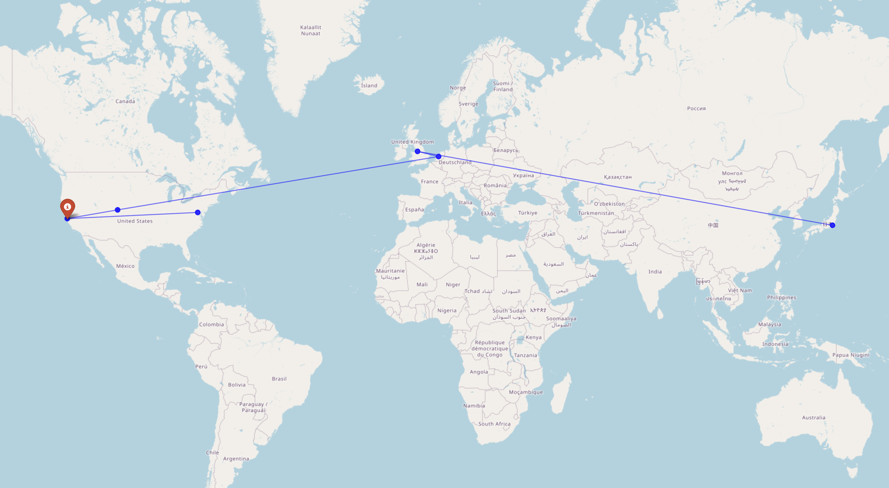

# YouGotMapped



YouGotMapped is a command-line network intelligence and visualization tool that correlates IP addresses and domains with geographic, routing, and performance data.

It integrates geolocation, latency analysis, traceroute inspection, and anonymity detection into a single, structured workflow, producing both human-readable output and machine-consumable logs.

---

## Overview

YouGotMapped is designed to provide visibility into how traffic traverses networks and where endpoints are geographically represented. It is suitable for diagnostic, educational, and research use in environments where the user has appropriate authorization.

The tool emphasizes clarity, traceability, and reproducibility of results.

---

## Key Capabilities

- IP and domain geolocation
- Interactive geographic visualization via HTML maps
- ICMP-based reachability and latency measurement
- Jitter analysis and stability inference
- TCP MSS discovery
- Bandwidth estimation using TCP performance models
- Hop-by-hop traceroute with geographic correlation
- VPN, proxy, and anonymity signal detection
- Structured output in JSON, CSV, or plain text formats

---

## Intended Use

YouGotMapped is intended for:

- Network diagnostics and troubleshooting
- Infrastructure visibility and analysis
- Educational exploration of routing behavior
- Authorized reconnaissance in controlled environments

Users are responsible for ensuring they have explicit permission to analyze any systems or networks they do not own.

---

## Prohibited Use

This project must not be used for:

- Unauthorized monitoring or surveillance
- Targeting individuals or private infrastructure
- Harassment, exploitation, or data misuse
- Any activity that violates applicable laws or policies

---

## Requirements

- Python 3.8 or newer
- Network access permitting ICMP and TCP probes
- Runtime dependencies:
  - `requests`
  - `folium`
  - `ping3`
  - `scapy`

Dependencies are validated at startup.

---

## Installation

YouGotMapped can be installed directly from PyPI:

```bash
pip install yougotmapped
```

After installation, the `yougotmapped` command is available on the system PATH.

### From Source

Clone the repository:

```bash
git clone https://github.com/your-username/YouGotMapped.git
cd YouGotMapped
```

Install dependencies:

```bash
pip install -r requirements.txt
```

Running from Source:

```bash
python -m yougotmapped.cli
```

---

## Usage

Analyze a single target using all available modules:

```bash
yougotmapped -i 8.8.8.8 -a
```

Export results as JSON:

```bash
yougotmapped -i 8.8.8.8 -a -o f:json
```

Disable map generation:

```bash
yougotmapped -i example.com -t --no-map
```

---

## Command-Line Options

```text
-i, --ip [IP ...]        IP addresses or domains
-f, --file FILE          Input file with targets
-p, --ping               Latency and reachability test
-j, --jitter             Jitter and stability analysis
-m, --mtu                MTU / MSS discovery
-b, --bandwidth          Bandwidth estimation
-t, --trace              Traceroute analysis
-c, --hidecheck          Anonymity detection
-a, --all                Run all modules
--no-map                 Disable map output
-o, --output             Output format (f:json, f:csv, f:normal)
```

---

## Output

Each execution produces:

* Structured log files with timestamps
* Optional interactive HTML maps
* Terminal summaries for immediate inspection

Outputs are designed to be both auditable and reproducible.

---

## Legal Notice

By using this software, you acknowledge that:

* You have authorization to analyze the specified targets
* You accept full responsibility for its use
* The author is not liable for misuse or resulting damages

This software is provided for educational and research purposes.

---

## Contributing

Contributions are welcome if they improve accuracy, reliability, or clarity and adhere to ethical and legal standards. Functionality that materially enables misuse will not be accepted.

---

## License

This project is licensed under the MIT License. See the LICENSE file for details.

